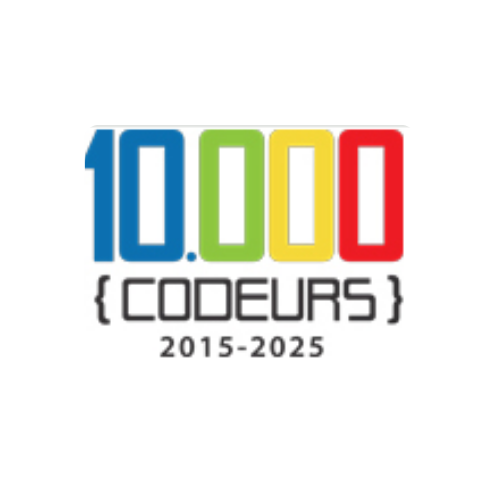

# Récupération d’ID Unique – 10 000 Codeurs

Formulaire web minimaliste permettant aux membres de 10 000 Codeurs de retrouver leur identifiant unique à partir de leur adresse e-mail.



---

## Fonctionnalités

- 🔍 Recherche de l’ID unique à partir de l’adresse e-mail
- 📧 Option d’envoi de l’ID par mail
- 💡 Interface moderne, simple et responsive
- 🔗 Intégration directe avec un workflow [n8n](https://n8n.io/) (aucun backend à coder)
- 🎨 Respect de la charte graphique 10 000 Codeurs

---

## Structure du projet

```

├── css/
│   └── style.css           # Styles du formulaire
├── images/
│   └── 10000CodeursLogo.png # Logo officiel
├── js/
│   └── script.js           # Logique JavaScript
├── index.html              # Structure principale de la page
├── .gitignore
└── README.md

```

---

## Utilisation

1. **Déposez le dossier sur [Netlify](https://www.netlify.com/) ou autre hébergeur statique**
2. **Configurez le webhook n8n** pour connecter le formulaire à votre base de données Google Sheets
3. **Le membre renseigne son e-mail** ➔ reçoit son ID unique à l’écran (et/ou par mail)

---

## Démo


---

## A propos

Ce projet a été conçu pour la communauté 10 000 Codeurs, afin de faciliter l’accès et la récupération de l’ID unique des membres.  
Développé avec amour par Anani Serge AMOUSSOUGBO.

---

## Licence

MIT
